## Part 1. Установка ОС

* Узнай версию Ubuntu, выполнив команду cat /etc/issue

    \
    `Версия системы`
    <br>
    <br>


## Part 2. Создание пользователя

* Вставь скриншот вызова команды для создания пользователя

    \
    `Команда создания нового пользователя`

* Новый пользователь должен быть в выводе команды cat /etc/passwd

    \
    `Вывод команды *cat /etc/passwd*`
    <br>
    <br>


## Part 3. Настройка сети ОС

* Задай название машины вида user-1

    \
    `Команда изменения имени ПК`

* Установи временную зону, соответствующую твоему текущему местоположению

    \
    `Команда изменения временной зоны`

* Выведи названия сетевых интерфейсов с помощью консольной команды

    \
    `Файлы всех сетевых интерфейсов содержатся в папке /sys/class/net`

* Используя консольную команду, получи ip адрес устройства, на котором ты работаешь, от DHCP сервера

    \
    `IP адрес от DHCP`

* Определи и выведи на экран внешний ip-адрес шлюза (ip) и внутренний IP-адрес шлюза, он же ip-адрес по умолчанию (gw)

    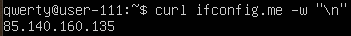\
    `Внешний IP адрес шлюза`

    \
    `Внутренний IP адрес шлюза`

* Задай статичные (заданные вручную, а не полученные от DHCP сервера) настройки ip, gw, dns (используй публичный DNS серверы, например 1.1.1.1 или 8.8.8.8)

    \
    `Файл конфигурации утилиты Netplan. Для применения настроек необходимо использовать команду *sudo netplan apply*`

* Перезагрузи виртуальную машину. Убедись, что статичные сетевые настройки (ip, gw, dns) соответствуют заданным в предыдущем пункте

    *Для перезагрузки используется команда:*
    ```shell
    sudo reboot 0
    ```
    *Для получения данных о сети используется утилита **ifconfig**:*
    ```shell
    sudo apt install net-tools
    ifconfig
    ```

    \
    `Файл конфигурации утилиты Netplan. Для применения настроек необходимо использовать команду *sudo netplan apply*`

* Успешно пропингуй удаленные хосты 1.1.1.1 и ya.ru и вставь в отчёт скрин с выводом команды. В выводе команды должна быть фраза «0% packet loss»

    \
    `ping 1.1.1.1`

    \
    `ping ya.ru`

**lo** - виртуальный интерфейс, использующийся при отладке/диагностике сети. ПК использует его для связи с самим собой. Также у такого интерфейса есть dns-имя - *localhost*.

**DHCP** - сетевой протокол, позволяющий компьютерам автоматически получать IP-адрес и другие параметры, необходимые для работы в сети TCP/IP.
<br>
<br>


## Part 4. Обновление ОС

* Обнови системные пакеты до последней на момент выполнения задания версии

    Для обновления используются следующие команды:

    ```shell
    sudo apt update
    sudo apt upgrade -y
    ```

    \
    `Обновление системы до последней версии`
    <br>
    <br>


## Part 5. Использование команды sudo

* **sudo** (англ. Substitute User and do, дословно «подменить пользователя и выполнить») — программа для системного администрирования UNIX-систем, позволяющая делегировать привилегированные ресурсы пользователям с ведением протокола работы.

* Поменяй hostname ОС от имени пользователя, созданного в пункте Part 2 (используя sudo)

    Использованные команды:

    ```shell
    sudo usermod -aG sudo newuser
    sudo su newuser
    sudo hostnamectl set-hostname user-111
    ```
    
    \
    `Измененное имя пользователя`
    <br>
    <br>


## Part 6. Установка и настройка службы времени

* Выведи время часового пояса, в котором ты сейчас находишься

    \
    `Текущее время и пояс`

* Вывод следующей команды должен содержать NTPSynchronized=yes: timedatectl show

    \
    `Вывод команды timedatectl show`

    \
    `Правильное время`
    <br>
    <br>


## Part 7. Установка и использование текстовых редакторов

* Используя каждый из трех выбранных редакторов, создай файл test_X.txt, где X -- название редактора, в котором создан файл. Напиши в нём свой никнейм, закрой файл с сохранением изменений

    \
    `VIM`

    \
    `NANO`

    \
    `JOE`

    Для выхода с сохранением использовались следующие команды:
    * **VIM** - `ESC` + `:` + `x`
    * **NANO** - `CTRL` + `x` + `y`
    * **JOE** - `CTRL` + `k` + `x`

* Используя каждый из трех выбранных редакторов, открой файл на редактирование, отредактируй файл, заменив никнейм на строку «21 School 21», закрой файл без сохранения изменений

    \
    `VIM`

    \
    `NANO`

    \
    `JOE`

    Для выхода с отменением изменений использовались следующие команды:
    * **VIM** - `ESC` + `:` + `q` + `!`
    * **NANO** - `CTRL` + `x` + `n`
    * **JOE** - `CTRL` + `c` + `y`

* Используя каждый из трех выбранных редакторов, отредактируй файл ещё раз (по аналогии с предыдущим пунктом), а затем освой функции поиска по содержимому файла (слово) и замены слова на любое другое

    \
    `VIM`

    \
    `VIM`


    \
    `NANO`

    \
    `NANO`


    \
    `JOE`

    \
    `JOE`

    Для выхода с отменением изменений использовались следующие команды:
    * **VIM** - `ESC` + `:` + `s` + `/что_заменить/чем_заменить`
    * **NANO** - `CTRL` + `\` + `что_заменить` + `ENTER` + `чем_заменить` + `a`
    * **JOE** - `CTRL` + `k` + `f` + `что_заменить` + `r` + `чем_заменить` + `y`
    <br>
    <br>


## Part 8. Установка и базовая настройка сервиса SSHD

* Установи службу SSHd

    ```shell
    sudo apt install ssh
    sudo apt install openssh-server
    ```

* Добавь автостарт службы при загрузке системы

    ```shell
    sudo systemctl enable ssh
    ```

* Перенастрой службу SSHd на порт 2022

    ```shell
    sudo vim /etc/ssh/sshd_config
    ```

    \
    `Нужно раскомментировать и изменить параметр *Port*`
    \
    \
    После перезапускаем службу:

    ```shell
    sudo systemctl restart ssh
    ```

* Используя команду ps, покажи наличие процесса sshd. Для этого к команде нужно подобрать ключи

    ```shell
    ps -A | grep sshd
    ```

    * -A - выбрать все процессы

    \
    `Результат команды ps -A | grep sshd`

* Вывод команды netstat -tan должен содержать tcp 0 0 0.0.0.0:2022 0.0.0.0:* LISTEN

    \
    `Результат работы утилиты netstat`

    * **-t** - выводить только tcp порты.
    * **-a** - просмотреть все порты.
    * **-n** - присваивание dns-имен, вместо ip (по возможности).
    
    Столбцы:
    * **Proto** - название протокола.
    * **Recv-Q** - количество байтов, не скопированных пользовательской программой, подключенной к этому сокету. Начиная с версии ядра 2.6.18, этот столбец содержит текущее отставание в синхронизации.
    * **Send-Q** - количество байтов, не подтвержденных удаленным хостом. Начиная с версии ядра 2.6.18, этот столбец содержит максимальный размер бэклога синхронизации.
    * **Local Address** - локальный IP-адрес участвующий в соединении или связанный со службой, ожидающей входящие соединения (слушающей порт). Если в качестве адреса отображается 0.0.0.0 , то это означает - "любой адрес", т.е в соединении могут использоваться все IP-адреса существующие на данном компьютере. Адрес 127.0.0.1 - это петлевой интерфейс, используемый в качестве средства IP протокола для взаимодействия между процессами без реальной передачи данных.
    * **Foreign Address** - внешний IP-адрес, участвующий в создании соединения.
    * **State** - состояние соединения. Состояние Listening говорит о том, что строка состояния отображает информацию о сетевой службе, ожидающей входящие соединения по соответствующему протоколу на адрес и порт, отображаемые в колонке "Локальный адрес". Состояние ESTABLISHED указывает на активное соединение. 
    <br>
    <br>


## Part 9. Установка и использование утилит top, htop

* По выводу команды top определи и напиши в отчёте:
    * **uptime** - 25 min
    * **количество авторизованных пользователей** - 1 user
    * **общую загрузку системы** - 0.18, 0.28, 0.35  
    * **общее количество процессов** - 115 tasks
    * **загрузку cpu** - 5.3 us, 2.2 sy, 0.0 ni, 93.2 id, 0.0 wa, 0.0 hi, 1.1 si, 0.0 st
    * **загрузку памяти** - 1076.6 total, 87.6 free, 653.8 used, 1231.4 buff/cache
    * **pid процесса занимающего больше всего памяти** - 21627
    * **pid процесса, занимающего больше всего процессорного времени** - 21627

* В отчёт вставь скрин с выводом команды htop:

    * Отсортированному по PID, PERCENT_CPU, PERCENT_MEM, TIME
        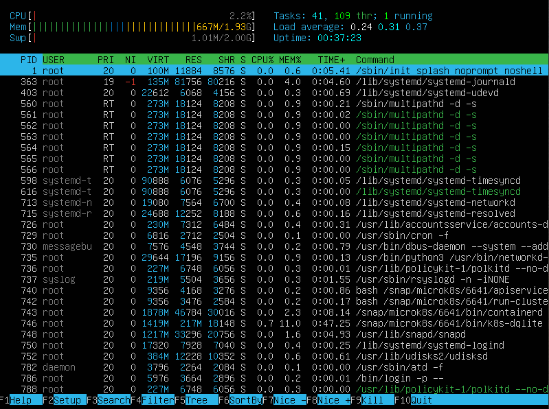\
        `Сортировка по PID`

        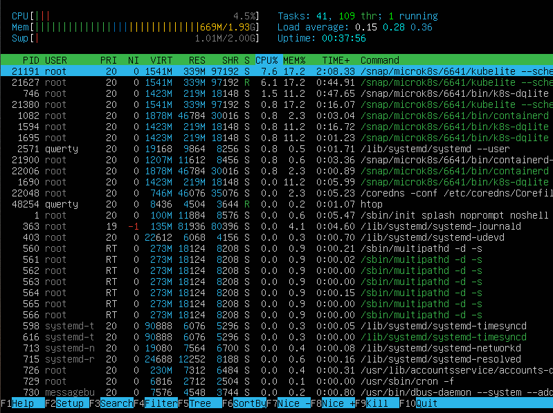\
        `Сортировка по PERCENT_CPU`

        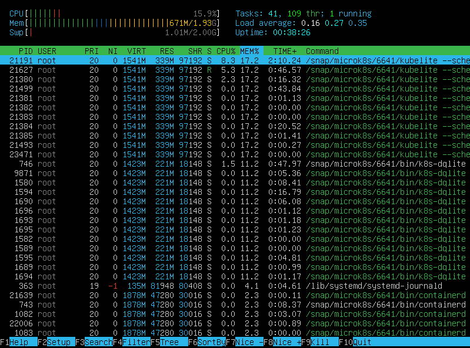\
        `Сортировка по PERCENT_MEM`

        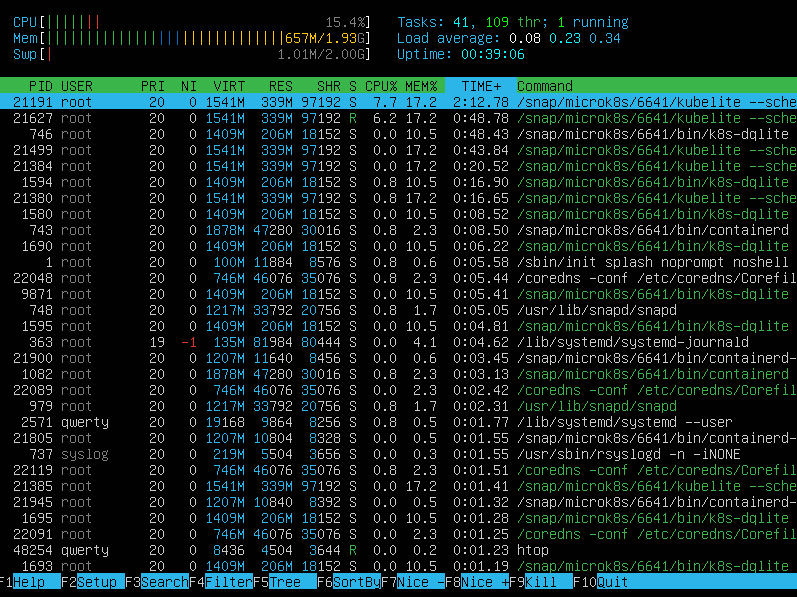\
        `Сортировка по TIME`

    * Отфильтрованному для процесса sshd
        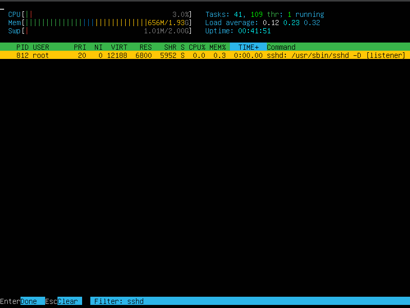\
        `Фильтрация процессов по sshd`

    * С процессом syslog, найденным, используя поиск
        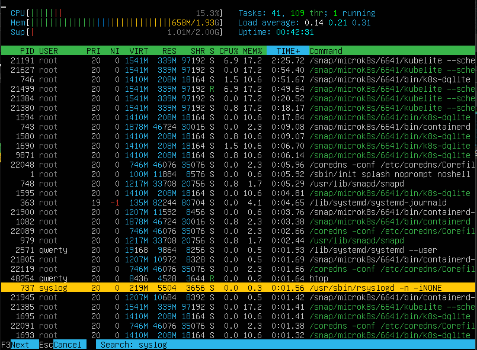\
        `Поиск по syslog`

    * С добавленным выводом hostname, clock и uptime
        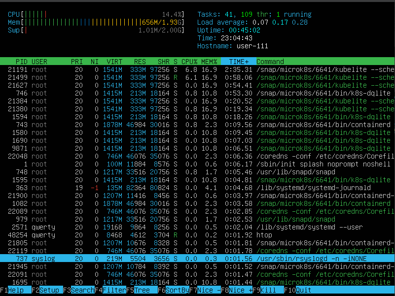\
        `Добавление параметров на главный экран`
    <br>
    <br>


## Part 10. Использование утилиты fdisk

* В отчёте напиши название жесткого диска, его размер и количество секторов, а также размер swap

    * **Название** - /dev/sda
    * **Размер** - 25 GiB
    * **Кол-во секторов** - 52428800 sectors
    * **Размер файла подкачки** - 2G

    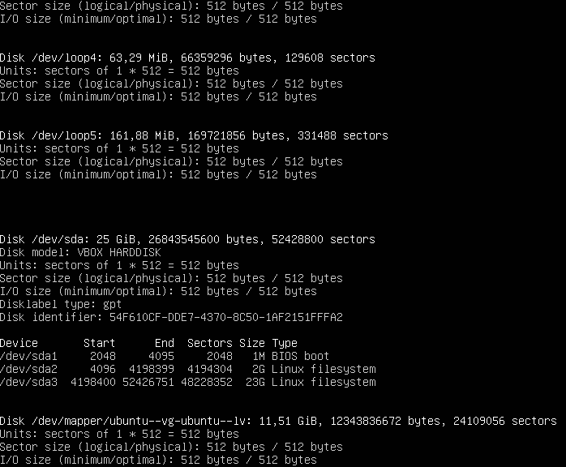\
    `sudo fdisk -l`
    <br>
    <br>


## Part 11. Использование утилиты df

* В отчёте напиши для корневого раздела (/):

    * размер раздела
    * размер занятого пространства
    * размер свободного пространства
    * процент использования

    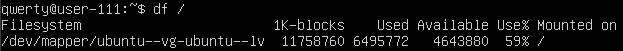\
    `df /`

* Определи и напиши в отчёт единицу измерения в выводе - килобайт

* В отчёте напиши для корневого раздела (/):

    * размер раздела
    * размер занятого пространства
    * размер свободного пространства
    * процент использования

    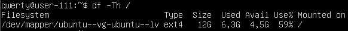\
    `df -Th`

* Определи и напиши в отчёт тип файловой системы для раздела - ext4
<br>
<br>


## Part 12. Использование утилиты du

* Запусти команду du

    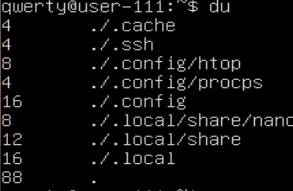\
    `du`


* Выведи размер папок /home, /var, /var/log (в байтах, в человекочитаемом виде)

    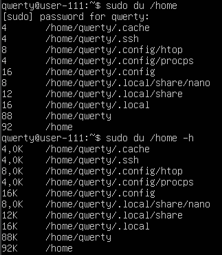\
    `sudo du /home, sudo du /home -h`

    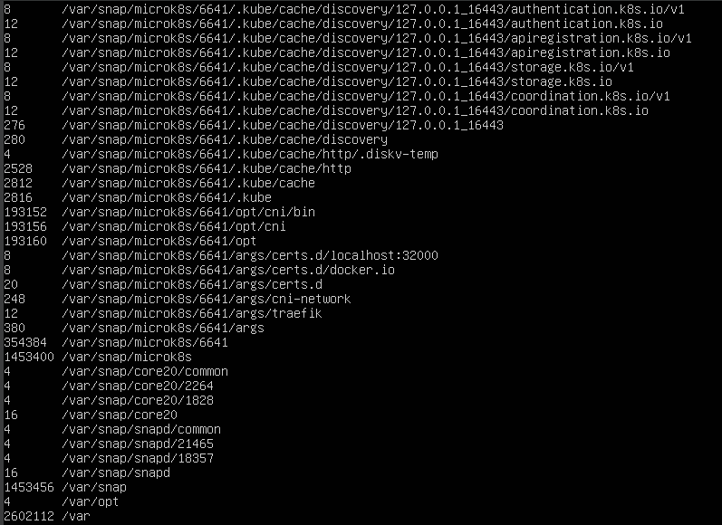\
    `sudo du /var`

    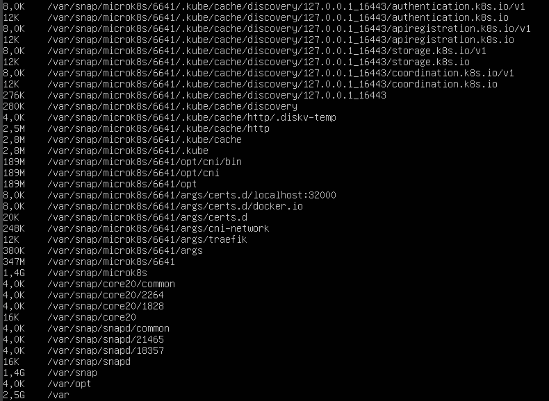\
    `sudo du /var -h`

    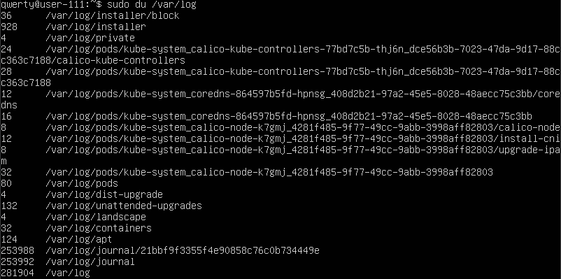\
    `sudo du /var/log`

    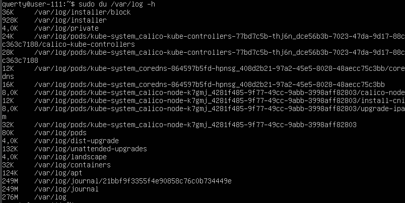\
    `sudo du /var/log -h`


* Выведи размер всего содержимого в /var/log (не общее, а каждого вложенного элемента, используя *)

    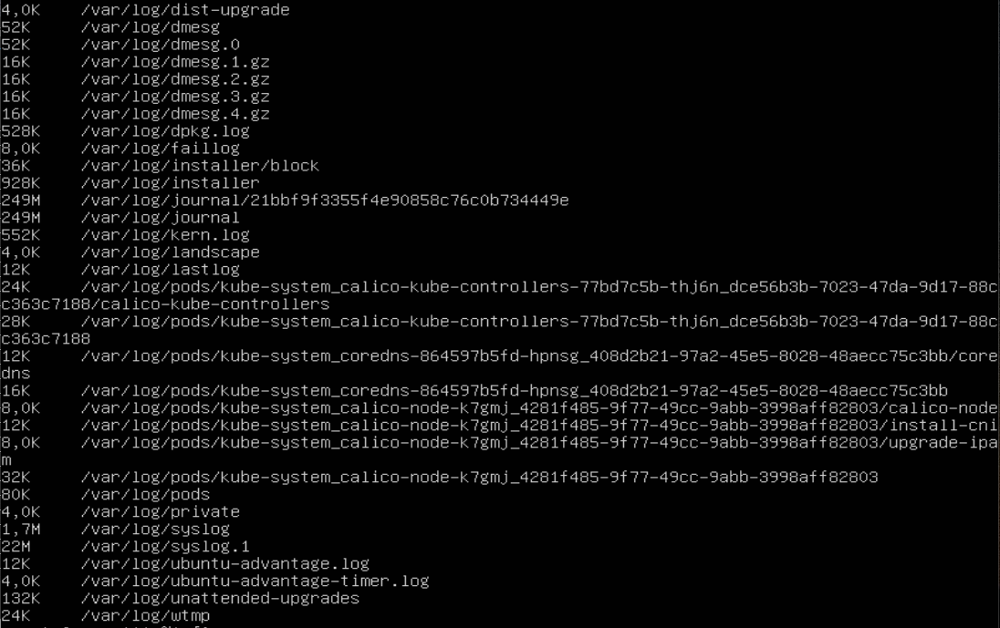\
    `sudo du /var/log/* -h`
<br>
<br>


## Part 13. Установка и использование утилиты ncdu

* Установи утилиту ncdu

    ```shell
    sudo apt install ncdu
    ```

* Выведи размер папок /home, /var, /var/log

    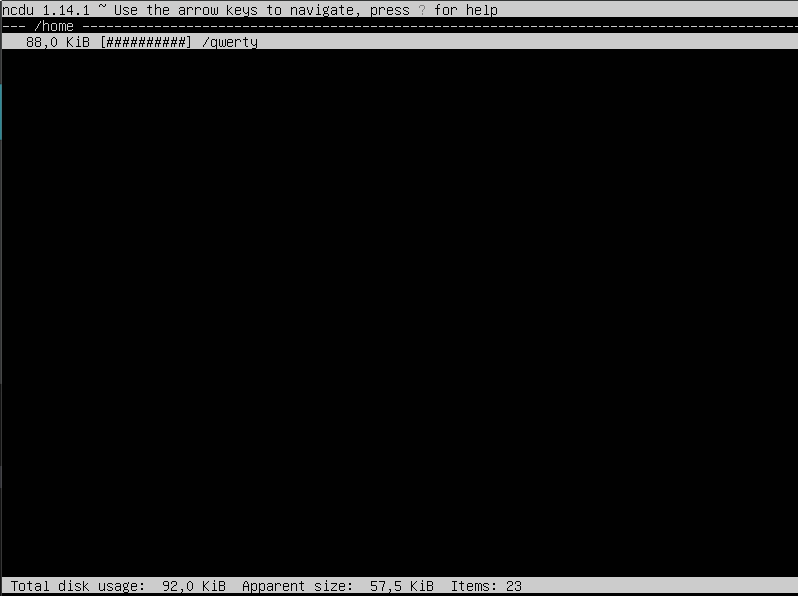\
    `ncdu /home`

    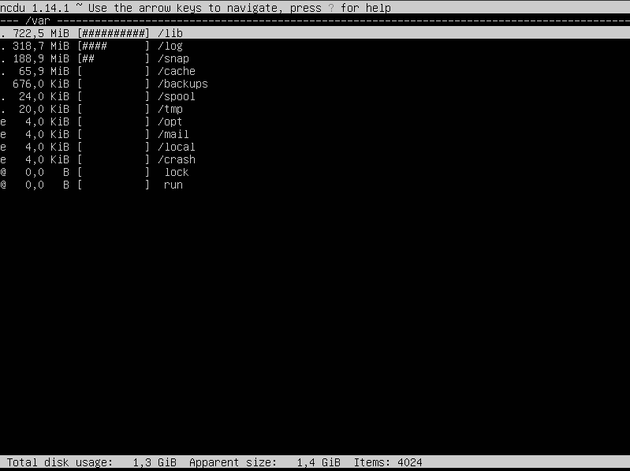\
    `ncdu /var`

    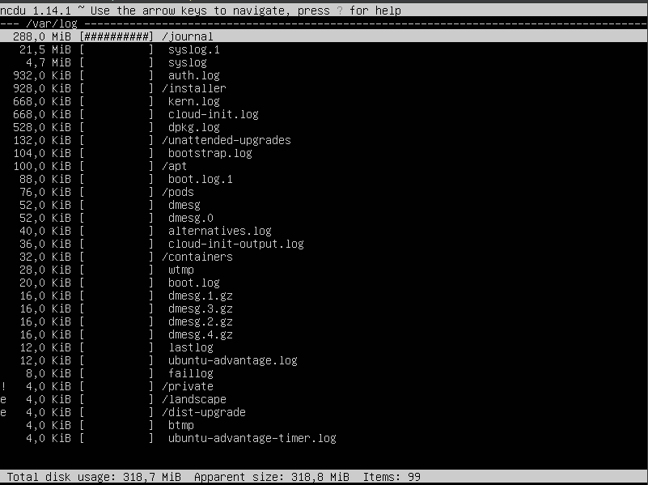\
    `ncdu /var/log`
<br>
<br>


## Part 14. Работа с системными журналами

* Открой для просмотра:

    1. /var/log/dmesg
    2. /var/log/syslog
    3. /var/log/auth.log

    ```shell
    sudo vim /var/log/dmesg
    sudo vim /var/log/syslog
    sudo vim /var/log/auth.log
    ```

* Напиши в отчёте время последней успешной авторизации, имя пользователя и метод входа в систему

    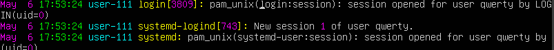\
    `Последняя авторизация в системе`

* Перезапусти службу SSHd

    ```shell
    sudo systemctl restart sshd
    ```

* Вставь в отчёт скрин с сообщением о рестарте службы (искать в логах)

    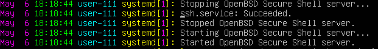\
    `Рестарт SSHd`
<br>
<br>


## Part 15. Использование планировщика заданий CRON

* Используя планировщик заданий, запусти команду uptime через каждые 2 минуты.
    ```shell
    crontab -e

    */2 * * * * uptime
    ```


* Найди в системных журналах строчки (минимум две в заданном временном диапазоне) о выполнении

    \
    `Выполнение команды uptime каждые 2 минуты`

* Выведи на экран список текущих заданий для CRON

    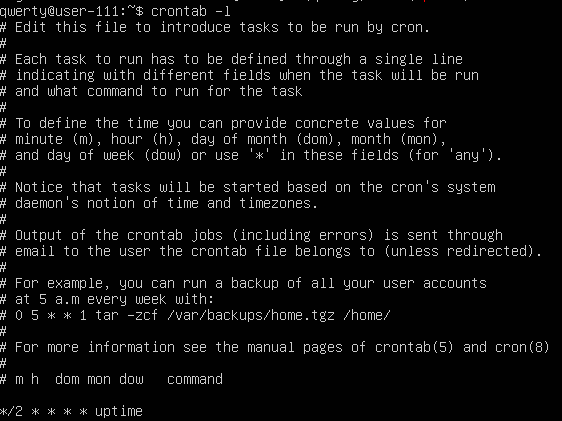\
    `Список задач`

* Удали все задания из планировщика заданий

    ```shell
    crontab -r
    ```

    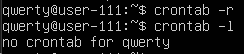\
    `Обновленный список задач`