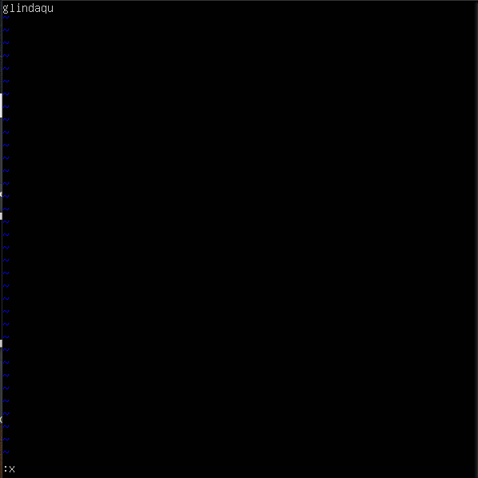

## Part 1. Установка ОС

* Узнай версию Ubuntu, выполнив команду cat /etc/issue.\
\
\
`Версия системы`
<br>
<br>


## Part 2. Создание пользователя

* Вставь скриншот вызова команды для создания пользователя.\
\
\
`Команда создания нового пользователя`
<br>
<br>

* Новый пользователь должен быть в выводе команды cat /etc/passwd.\
\
\
`Вывод команды *cat /etc/passwd*`
<br>
<br>


## Part 3. Настройка сети ОС

* Задай название машины вида user-1.\
\
\
`Команда изменения имени ПК`
<br>
<br>

* Установи временную зону, соответствующую твоему текущему местоположению.\
\
\
`Команда изменения временной зоны`
<br>
<br>

* Выведи названия сетевых интерфейсов с помощью консольной команды.\
\
\
`Файлы всех сетевых интерфейсов содержатся в папке /sys/class/net`
\
\
**lo** - виртуальный интерфейс, использующийся при отладке/диагностике сети. ПК использует его для связи с самим собой. Также у такого интерфейса есть dns-имя - *localhost*.
<br>
<br>

* Используя консольную команду, получи ip адрес устройства, на котором ты работаешь, от DHCP сервера.\
\
\
`IP адрес от DHCP`
\
\
**DHCP** - сетевой протокол, позволяющий компьютерам автоматически получать IP-адрес и другие параметры, необходимые для работы в сети TCP/IP.
<br>
<br>

* Определи и выведи на экран внешний ip-адрес шлюза (ip) и внутренний IP-адрес шлюза, он же ip-адрес по умолчанию (gw).\
\
\
`Внешний IP адрес шлюза`
<br>
<br>

* Задай статичные (заданные вручную, а не полученные от DHCP сервера) настройки ip, gw, dns (используй публичный DNS серверы, например 1.1.1.1 или 8.8.8.8).\
\
\
`Файл конфигурации утилиты Netplan. Для применения настроек необходимо использовать команду *sudo netplan apply*`
<br>
<br>

* Перезагрузи виртуальную машину. Убедись, что статичные сетевые настройки (ip, gw, dns) соответствуют заданным в предыдущем пункте.\
\
*Для перезагрузки используется команда:*
    ```shell
    sudo reboot 0
    ```
    *Для получения данных о сети используется утилита **ifconfig**:*
    ```shell
    sudo apt install net-tools
    ifconfig
    ```

    \
    `Файл конфигурации утилиты Netplan. Для применения настроек необходимо использовать команду *sudo netplan apply*`
<br>
<br>

* Успешно пропингуй удаленные хосты 1.1.1.1 и ya.ru и вставь в отчёт скрин с выводом команды. В выводе команды должна быть фраза «0% packet loss».\
\
\
`ping 1.1.1.1`
\
\
\
`ping ya.ru`
<br>
<br>


## Part 4. Обновление ОС

* Обнови системные пакеты до последней на момент выполнения задания версии.
\
\
Для обновления используются следующие команды:

    ```shell
    sudo apt update
    sudo apt upgrade -y
    ```

    \
    `Обновление системы до последней версии`
<br>
<br>


## Part 5. Использование команды sudo
* **sudo** (англ. Substitute User and do, дословно «подменить пользователя и выполнить») — программа для системного администрирования UNIX-систем, позволяющая делегировать привилегированные ресурсы пользователям с ведением протокола работы.
* Поменяй hostname ОС от имени пользователя, созданного в пункте Part 2 (используя sudo).
\
\
    Использованные команды:

    ```shell
    sudo usermod -aG sudo newuser
    sudo su newuser
    sudo hostnamectl set-hostname user-111
    ```
    \
    \
    `Измененное имя пользователя`
<br>
<br>


## Part 6. Установка и настройка службы времени

* Выведи время часового пояса, в котором ты сейчас находишься.
\
\
\
`Текущее время и пояс`

* Вывод следующей команды должен содержать NTPSynchronized=yes: timedatectl show
\
\
\
`Вывод команды timedatectl show`
\
\
\
`Правильное время`
<br>
<br>


## Part 7. Установка и использование текстовых редакторов

* Используя каждый из трех выбранных редакторов, создай файл test_X.txt, где X -- название редактора, в котором создан файл. Напиши в нём свой никнейм, закрой файл с сохранением изменений.

    
    `VIM`

    
    `NANO`

    
    `JOE`

    Для выхода с сохранением использовались следующие команды:
    * **VIM** - `ESC` + `:` + `x`
    * **NANO** - `CTRL` + `x` + `y`
    * **JOE** - `CTRL` + `k` + `x`

* Используя каждый из трех выбранных редакторов, открой файл на редактирование, отредактируй файл, заменив никнейм на строку «21 School 21», закрой файл без сохранения изменений.

    
    `VIM`

    
    `NANO`

    
    `JOE`

    Для выхода с отменением изменений использовались следующие команды:
    * **VIM** - `ESC` + `:` + `q` + `!`
    * **NANO** - `CTRL` + `x` + `n`
    * **JOE** - `CTRL` + `c` + `y`

* Используя каждый из трех выбранных редакторов, отредактируй файл ещё раз (по аналогии с предыдущим пунктом), а затем освой функции поиска по содержимому файла (слово) и замены слова на любое другое.

    
    `VIM`

    
    `VIM`


    
    `NANO`

    
    `NANO`


    
    `JOE`

    
    `JOE`

    Для выхода с отменением изменений использовались следующие команды:
    * **VIM** - `ESC` + `:` + `s` + `/что_заменить/чем_заменить`
    * **NANO** - `CTRL` + `\` + `что_заменить` + `ENTER` + `чем_заменить` + `a`
    * **JOE** - `CTRL` + `k` + `f` + `что_заменить` + `r` + `чем_заменить` + `y`